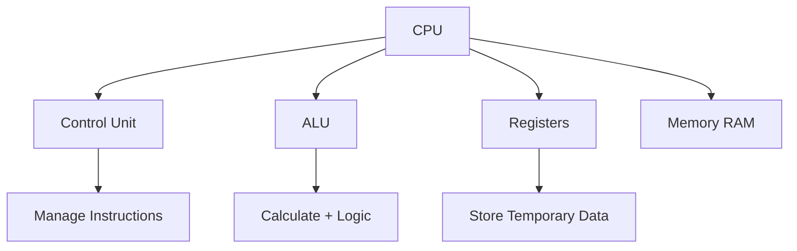

# Latihan-11 DSK

1. **Diagram CPU sederhana.**

- **CPU (Central Processing Unit)** adalah pusat pemrosesan utama komputer yang mengatur dan menjalankan semua instruksi.
- **Control Unit (CU)** bertugas **mengatur jalannya instruksi** — mengontrol alur data antara komponen CPU dan memori.
- **ALU (Arithmetic Logic Unit)** berfungsi untuk **melakukan operasi aritmetika dan logika**, seperti penjumlahan, pengurangan, dan perbandingan.
- **Registers** adalah **tempat penyimpanan kecil di dalam CPU** untuk menyimpan data sementara saat proses berlangsung.
- **Memory (RAM)** digunakan untuk **menyimpan data dan instruksi sementara** yang sedang diproses oleh CPU.

1. **Jelaskan tahap siklus instruksi.**

Tahap siklus instruksi (instruction cycle) adalah proses yang dilakukan CPU untuk mengambil, memahami, dan menjalankan instruksi dari memori. Ada tiga tahap utama, yaitu:

- **Fetch (Pengambilan Instruksi)**
    - CPU mengambil (fetch) instruksi dari **memori utama (RAM)** menggunakan **Program Counter (PC)** yang menunjukkan alamat instruksi berikutnya.
    - Instruksi tersebut disimpan ke dalam **Instruction Register (IR)**.
- **Decode (Penerjemahan Instruksi)**
    - **Control Unit (CU)** menerjemahkan (decode) instruksi yang ada di IR untuk mengetahui **apa yang harus dilakukan** — misalnya, operasi aritmetika, logika, atau perpindahan data.
    - CU menentukan **komponen mana** yang perlu bekerja (misalnya ALU, register, atau memori).
- **Execute (Pelaksanaan Instruksi)**
    - CPU melaksanakan perintah tersebut.
        
        Contohnya:
        
        - Jika operasi matematika, maka **ALU** akan menghitung.
        - Jika perpindahan data, maka data dipindahkan ke/dari register atau memori.
    - Hasil eksekusi bisa disimpan kembali ke register atau RAM.

1. **Bandingkan single bus vs multiple bus.**

| Aspek | **Single Bus** | **Multiple Bus** |
| --- | --- | --- |
| **Jumlah Jalur Bus** | Hanya **satu bus utama** yang digunakan untuk menghubungkan semua komponen (CPU, memori, dan I/O). | Terdiri dari **lebih dari satu bus**, misalnya bus memori, bus I/O, dan bus sistem yang terpisah. |
| **Lalu Lintas Data** | Semua komponen **berbagi jalur yang sama**, sehingga bisa terjadi **bentrok (bottleneck)** saat beberapa perangkat ingin mengirim data bersamaan. | **Setiap bus punya jalur sendiri**, jadi transfer data bisa dilakukan **secara paralel** dan lebih cepat. |
| **Kecepatan Transfer** | **Lebih lambat**, karena hanya satu jalur yang harus dipakai bergantian. | **Lebih cepat**, karena beberapa transfer bisa dilakukan secara bersamaan. |
| **Kompleksitas Desain** | **Sederhana dan murah** untuk dirancang dan diimplementasikan. | **Lebih kompleks dan mahal** karena butuh lebih banyak jalur dan pengendali (controller). |
| **Contoh Penggunaan** | Cocok untuk **sistem sederhana atau komputer lama**. | Digunakan pada **komputer modern dan sistem performa tinggi**. |
1. **Simulasikan pipeline 3 instruksi.**

| **Siklus** | **1** | **2** | **3** | **4** | **5** |
| --- | --- | --- | --- | --- | --- |
| **I1** | F | D | E |  |  |
| **I2** |  | F | D | E |  |
| **I3** |  |  | F | D | E |

Penjelasan:

- Cycle 1: CPU ambil instruksi pertama (I1).
- Cycle 2:
    - I1 masuk tahap Decode (D)
    - I2 mulai Fetch (F)
- Cycle 3:
    - I1 → Execute
    - I2 → Decode
    - I3 → Fetch
- Setelah itu pipeline terus jalan — tiap siklus bisa memproses 3 instruksi sekaligus (masing-masing di tahap berbeda).

Jadi : 

- Pipeline 3 tahap = **Fetch – Decode – Execute**
- Setelah diisi penuh, CPU bisa **menyelesaikan 1 instruksi per siklus**
- Untuk 3 instruksi total, butuh **5 siklus** (3 tahap + 2 siklus pengisian).

1. Diskusikan RISC vs CISC.

sc : [https://www.geeksforgeeks.org/computer-organization-architecture/computer-organization-risc-and-cisc/](https://www.geeksforgeeks.org/computer-organization-architecture/computer-organization-risc-and-cisc/)

RISC and CISC are two different ways of designing computer processors.

- RISC uses a small set of simple, fixed-size instructions designed to execute in a single clock cycle.
    
    (RISC menggunakan sekumpulan kecil instruksi sederhana berukuran tetap yang dirancang untuk dieksekusi dalam satu siklus clock.)
    
- CISC includes a larger set of instructions, many of which are complex and can perform multiple operations (e.g., memory access and computation) in a single instruction.
    
    (CISC mencakup sekumpulan instruksi yang lebih besar, banyak di antaranya kompleks dan dapat melakukan beberapa operasi (misalnya, akses memori dan komputasi) dalam satu instruksi.)
    
- CISC instructions often require multiple clock cycles.
    
    (Instruksi CISC seringkali memerlukan beberapa siklus clock.)